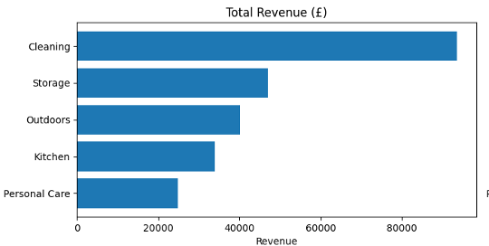
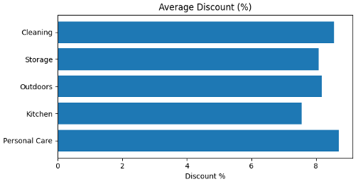
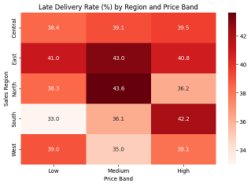
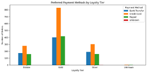
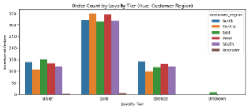
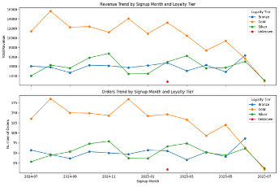

# **📊 Sales & Customer Behaviour Insights – Green Cart Ltd.**

# **📌 Project Overview**

This project analyses sales performance, customer behaviour, and delivery operations for Green Cart Ltd., a UK-based e-commerce company specialising in eco-friendly household products. The analysis was conducted to support the company’s Q2 performance review and enable data-driven decision-making across marketing, sales, and operations.

The project focuses on transforming raw transactional, product, and customer data into meaningful business insights through data cleaning, feature engineering, exploratory analysis, and visualisation.

⸻

# **🎯 Project Objectives**

	•	Clean and validate sales, product, and customer datasets
	•	Merge multiple data sources into a unified analytical dataset
	•	Engineer features to enhance analytical depth
	•	Identify revenue drivers, customer trends, and operational risks
	•	Present insights using clear visualisations and summary tables

⸻

# **🗂️ Datasets Used**

The analysis is based on three CSV datasets:

	•	sales_data.csv – Order-level transactions, pricing, discounts, delivery status
	•	product_info.csv – Product details, categories, launch dates, base prices
	•	customer_info.csv – Customer demographics, signup dates, loyalty tiers

⸻

# **🧹 Data Cleaning & Preparation**

Key data quality steps included:

	•	Standardising categorical fields (e.g. delivery status, regions, loyalty tiers)
	•	Fixing typos and inconsistent text formatting
	•	Handling missing values using business-appropriate defaults
	•	Converting date fields to proper datetime formats
	•	Validating numeric fields (quantity, prices, discounts)
	•	Handling duplicate order IDs (multi-line orders vs order-level KPIs)
	•	Cleaning and validating email formats

⸻

# **🛠️ Feature Engineering**

New features were created to support deeper analysis, including:
	•	Revenue – Quantity × Unit Price × (1 − Discount)
	•	Order Week – Weekly aggregation for trend analysis
	•	Price Band – Low / Medium / High pricing categories
	•	Days from Signup – Customer lifecycle timing
	•	Email Domain – Customer contact pattern analysis
	•	Is Late – Delivery performance indicator

These features enabled improved segmentation, trend detection, and performance comparison.

⸻

# **📈 Key Analyses & Visualisations**

The project includes multiple visual and analytical components:
	•	Weekly revenue trends by region
	•	Product category performance (revenue, quantity, discount usage)
	•	Customer behaviour by loyalty tier and signup cohort
	•	Delivery performance by region and price band
	•	Payment method preferences by loyalty tier
	•	Correlation analysis between revenue, quantity, and discounts

## 📈 Key Visual Insights

### Weekly Revenue Trends by Region

### Top Product Categories by Revenue and Discount

### Delivery Delay Heatmap

### Total Revenue by Region with Price Band Products

### Preferred Payment Method by Loyalty Tier

### Total Order Volume by Loyalty Tier and by Region

### Customer Behavior Loyalty

⸻

# **🔍 Key Insights**

	•	Revenue shows strong seasonality, peaking mid-period across all regions but with Central and
        West contributing most
	•	Cleaning products are the primary revenue driver while the Personal Care segment underperforms
        and relies more heavily on discounting.
	•	Gold-tier customers generate the highest value and order volume and they are mostly active in the Central and West regions
	•	Discounts have a limited impact on increasing sales volume
	•	Delivery delays are most common in Medium and High price bands in North, East, and South regions, respectively
	•	High-value orders require improved logistics reliability

⸻

# **🚀 Business Recommendations**

	•	Focus marketing and inventory efforts on high-performing categories and regions
	•	Strengthen loyalty programs targeting Gold-tier customers
	•	Reduce reliance on discounting for underperforming categories
	•	Prioritise delivery improvements for high-value orders and regions with high delay rates
	•	Align Marketing with Customer Signup Cohorts (Customers who signed up during mid-period months exhibit higher purchasing activity)

⸻

**⚠️ Data Issues & Limitations**

	•	Some orders occurred before recorded signup dates due to data generation constraints
	•	No discounts exceeded 20%, limiting high-discount analysis
	•	Guest checkout and historical data migration scenarios affect lifecycle metrics

Recommendations include improved event validation, clearer customer lifecycle tracking, and automated data quality checks.

⸻

**🧪 Optional Stretch Analysis**

	•	Advanced .query() filters for customer behaviour analysis
	•	Revenue normalisation using MinMaxScaler
	•	Identification of underperforming products based on volume, discount, and delay metrics

⸻

**🧰 Tools & Technologies**

	•	Python
	•	Pandas & NumPy
	•	Matplotlib & Seaborn
	•	Scikit-learn (MinMaxScaler)
	•	Jupyter Notebook / Google Colab

⸻
# **✅ Conclusion**

This project demonstrates a complete end-to-end data analytics workflow—from raw data cleaning to business-ready insights—highlighting how structured analysis can drive strategic decision-making in an e-commerce environment.
